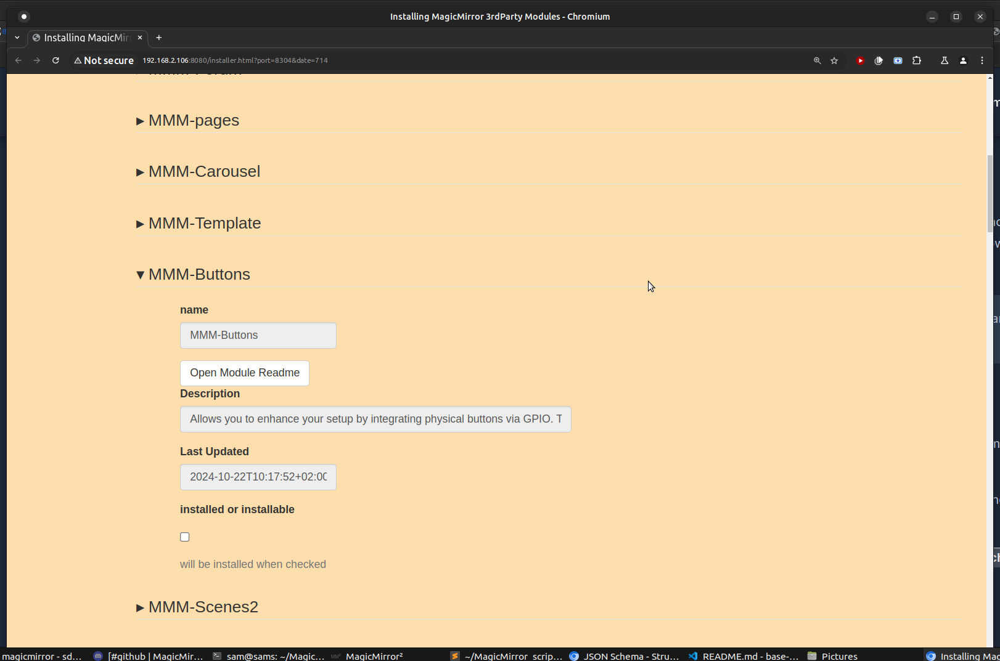
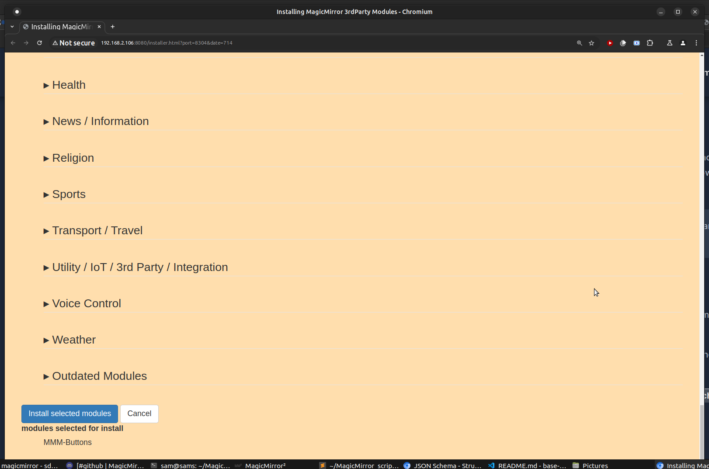

### This is the web driven MagicMirror module installer

#### it gets the list of modules from the 3rd party module list

* by default, the categories are sorted alphabetically, with the Outdated category moved to the bottom

* modules are sorted in category by last date updated by default
* * but you can change this when you start the installer by adding the word **name**  as a parameter (see below)

* you can select as many modules as you like, see the example page below

* you can open the module readme by pressing the open Readme button
 <be>this will allow you to see more about the module than the description, to help you decide if this module is what you want

* a selected module list will be maintained at the bottom of the page (adding/removing as modules are selecte/deselecte)


* * if a module is already installed, its selection will be marked (and cannot be unselected)
* * this application will NOT remove modules.. you can disable them in the configurator (second step)

* once the module installs are a completed, press the<br> **Install selected modules** <br>button, <br>the install list screen will be closed

* A new MagicMirror instance will be started (using a different port), using the configured configuration file (config.js) with MMM-Config installed (added to the config.js if required)
* see the MMM-Config readme (https://github.com/sdetweil/MMM-Config)
<br>press **Save, Create Config** and an updated config.js will be written (saving the prior, see MMM-Config)

if MagicMirror is running under pm2, then MagicMirror will be restarted with the new config
   (requires MMM-Config pm2: option)
   if your pm2 configuration auto restarts on config change, it will restart automatically

-------

to install this module (on a linux system, windows support still being developed (Jan 13,2024))
copy paste this line
```bash
bash -c  "$(curl -sL https://raw.githubusercontent.com/sdetweil/installer/refs/heads/main/installit)"
```
see the section below on docker for how to do this using a docker container

to launch the installer do 

two ways, using the hosted command

```bash
bash -c  "$(curl -sL https://raw.githubusercontent.com/sdetweil/installer/refs/heads/main/launchit)"
```
if you run launchit, and do NOT specify the type as a parm (folder or docker) then if both options are found 
it will ask which one you want to do (if only one is detected you won't be prompted)

launchit folder its_name if not MagicMirror and sort order (name or date, default)

or if NOT using mm in a docker container, do 
```bash 
cd ~/MagicMirror
./run_installer 
```
see the section below on docker for how to do this using a [docker container](#setup-for-running-the-installer-in-a-docker-container)
<br>
I have not tried this on a snyology nas server (yet)

give it a try, issues to this github repo please. 

# images

## the installer page looks like this


## and the bottom


## with a category expanded


## with a unregistered section expanded, and one entry created<br>

the plus/minus buttons allow you to add more entries or remove one>br>
thes individual minus button is remove THIS entry<br>
while the other are add/remove at the end of the list


# a module entry expanded not selected


# a module entry expanded module selected


# the list at the bottom of modules selected to install


# and multiple modules selected


<div style="page-break-after: always;"></div>

# setup for running the installer in a docker container

we need to add some properties to the container 

* a mount for a folder called installers inside the container, and its real folder on the docker host (here in the mounts folder)
* a port at 9000:9000
* a port range 8300-8303:8300-8302

for [kHassel's docker container ](https://gitlab.com/khassel/magicmirror) I added the following lines
 to **magicmirror/run/compose.yaml**
```yaml
    restart: unless-stopped
	#
	# added
	# 
    ports:
      - "8300-8302:8300-8302"
      - "9000:9000"
    volumes:
      - ../mounts/installers:/opt/magic_mirror/installers:rw
	#
	#  end of added
	#  
    extends:
```

in the **magicmirror/mounts** folder I created the **installers** folder
note you can put it anywhere on your docker host, and call it any name.<br>

If you change the location, also change the front part of the volume above 
(before the :/opt)

after the container is up and running, 
on the docker host you sould be able to 
```sh
docker exec -it mm bash
```
 and 
 ```
 ls
 ```
 should show the installers folder
 ```sh
 exit
 ```
 to return from the container prompt

 and on the docker host
 the output of docker inspect mm should show the extra ports and the volume mapping, which was proven in the prior step 

copy/paste the installer link above
```bash
bash -c  "$(curl -sL https://raw.githubusercontent.com/sdetweil/installer/refs/heads/main/installit)"
```

and add 1 or 2 parameters..  
* docker
* (optionally) the name of the docker container, #khassels container name setup uses mm, which is set as the default


# running the Module installer

as the the installer is a separate application, you need to open a terminal window and execute a command 
```bash
bash -c  "$(curl -sL https://raw.githubusercontent.com/sdetweil/installer/refs/heads/main/launchit)"
```
this will locate the container, exec into it and start the installer app

status messages will be presented in this terminal window

if you are connected to your MagicMirror system over ssh, (or running it in the MagicMirror docker container) the application cannot open a web browser on your system, so you will have to copy paste a line into an terminal window on your machine, or copy/paste just the url portion from the shown command

note that the command will automatically try to detect what type of MagicMirror runtime you have  local folder or docker, 

here is an example on a system with both options available

the default is folder, if you just press enter
```text
found both docker and a local folder
which do you want to use? d(ocker)/F(older)d

I see that you are running the installer in a docker container, I cannot open a browser on your machine

I cannot tell which OS you are using, so you need to select one of these choices

	 linux/raspberry pi os, xdg-open http://localhost:8081/startup

	 macos, open http://localhost:8081/startup

	 windows, start http://localhost:8081/startup

 and copy/paste the command into a terminal window 
you will have to find the host mapping of this port number 8081

 I will close the browser page when you are done
```

